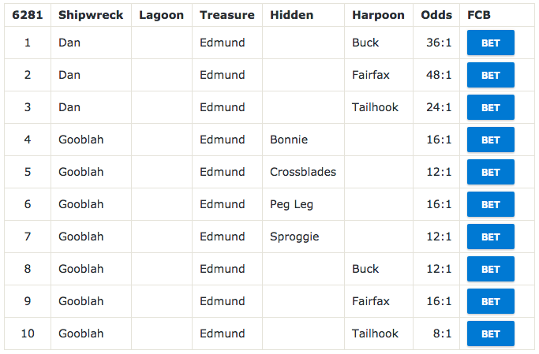

r/neopets Food Club Better
==========================

Description
-----------

A userscript to turn tables on reddit into bets on Food Club.

This userscript allows you to quickly fill out Food Club bets posted by other users on reddit.

Installation
------------

1. As this is a userscript, it requires [Greasemonkey](https://addons.mozilla.org/en-US/firefox/addon/greasemonkey/), (Firefox), or [Tampermonkey](https://chrome.google.com/webstore/detail/tampermonkey/dhdgffkkebhmkfjojejmpbldmpobfkfo?hl=en) (Chrome). I've only tested the script in Chrome.
2. View the raw .user.js script file below (or [click here](https://github.com/hooksfordays/food-club-better/raw/master/food-club-better.user.js))
3. Click 'Install'

Usage
-----

1. Visit the daily Food Club Bets thread, always an announcement at the top of [r/neopets](https://www.reddit.com/r/neopets/).
2. Find a table, such as the one pictured below, containing bets that you want to place.
    
3. Click the 'Bet' button next to the bet you want to place
4. In the window that opens, just click 'Place this bet!'
